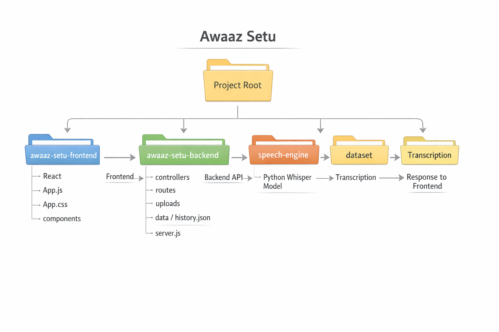

# 🎤 Offline_Speech_to_Text_System

A **web‑based offline speech‑to‑text system** that converts spoken Hindi audio into accurate text using the **Whisper deep learning model**. Users can record audio directly from the browser or upload audio files for transcription.

---

# 🚀 Features

- 🎤 Live microphone recording  
- 📁 Upload audio files (WAV, MP3)  
- 🧠 Speech recognition using **Whisper model**  
- 🌐 Offline speech processing  
- 📝 Accurate Hindi transcription output  
- 🎨 Modern dark‑theme web interface  

---

# 🛠 Tech Stack

### Frontend
- HTML
- CSS
- JavaScript / React

### Backend
- Python
- FastAPI

### Machine Learning
- OpenAI Whisper
- PyTorch
- Librosa

### Dataset
- Mozilla Common Voice (Hindi)

---

# 📂 Project Structure

# ▶ Usage
- Open the web interface
- Record audio or upload a speech file
- The system processes speech using the Whisper model
- Hindi text transcription appears in the output panel

# 🎯 Project Goal
The goal of this project is to build an offline speech recognition system for Hindi that improves accessibility and allows users to convert spoken language into text without relying on internet connectivity.

# 📌 Future Improvements
- 🌍 Real‑time speech translation
- 📊 Confidence score visualization
- 🕓 Transcription history
- 📱 Mobile responsive UI

# 📜 License
This project is developed for educational and research purposes.
